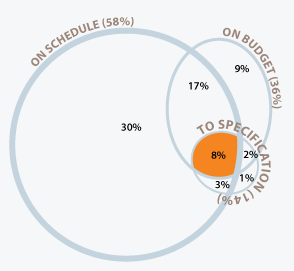

```{r setup,include=FALSE}
knitr::opts_chunk$set(echo = TRUE, cache = TRUE, message = FALSE, warning = FALSE)
library(rmarkdown)
library(lubridate)
```

`r if(!knitr::is_html_output()) {sprintf(fmt = "* &#x1f468;&#x1F3FB;&#x200d;&#x1f4bb; Author: %s", params$author)}`
`r sprintf(fmt = "* &#x1f4da; Specialization: [%s](%s){target='_blank' rel='noopener'}", params$specialization, params$specialization_url)`
`r sprintf(fmt = "* &#x1f4d6; Course: [%s](%s){target='_blank' rel='noopener'}", params$course, params$course_url)`
    `r sprintf(fmt = "* &#x1F9D1;&#x200d;&#x1F3EB; Instructor: %s", params$instructor)`
`r sprintf(fmt = "* &#x1F4C6; %s", params$week)`
    `r sprintf(fmt = "* &#x1F6A6; Start: %s", format(params$course_start, "%A, %d %B %Y"))`
    `r sprintf(fmt = "* &#x1F3C1; Finish: %s", format(params$course_finish, "%A, %d %B %Y"))`
`r if(!knitr::is_html_output()) {"* &#x1F30E; Rpubs: [Interactive Document](https://rpubs.com/AndersonUyekita/quiz-2_introduction-to-software-product-management)"}else{"* &#x1F4E6; Github Repository: [Static Document](https://github.com/AndersonUyekita/introduction-to-software-product-management/blob/main/Week%202/quiz-2_introduction-to-software-product-management.md){target='_blank' rel='noopener'}"}`

--------------------------------------------------------------------------------

I have found the answers in the [Course Notes.](https://github.com/AndersonUyekita/introduction-to-software-product-management/blob/main/resources/c1-course-notes-introduction-to-software-product-management.pdf)

## Question 1

According to a survey conducted in 2013 by Scott Ambler + Associates, 58% of respondents defined project success by what criteria?

- [x] project on schedule
- [ ] project on budget
- [ ] project meets specification
- [ ] all of the above

**Answer**

According to the below Venn Diagram, On Schedule has 58%.



Source: http://www.ambysoft.com/surveys/success2013.html

## Question 2

The Manifesto for Agile Software Development specifically says it values ____ over comprehensive documentation?

- [ ] responding to change
- [ ] customer collaboration
- [ ] individuals and interactions
- [x] working software

**Answer**

> * Individuals and interactions over processes and tools
> * **Working software over comprehensive documentation**
> * Customer collaboration over contract negotiation
> * Responding to change over following a plan

## Question 3

The Manifesto for Agile Software Development says it values ____ less.

- [ ] customer collaboration
- [x] following a plan
- [ ] individuals and interactions
- [ ] working software

**Answer**

> The Agile philosophy values the items on the left more than the items on the right. This is not to suggest that you ignore processes and tools, comprehensive documentation, contract negotiation, or **following a plan**. It is merely that the items on the left are the more important things to focus on

> * Responding to change over following a plan

## Question 4

As an Agile principle, what is the primary measure of progress in the project?

- [x] working software
- [ ] sustainable development
- [ ] technical excellence
- [ ] satisfying the customer

**Answer**

>* Working Prototypes as Progress: Working Software is the primary measure of progress.

## Question 5

In a software process, in which phase do you determine what the software is expected to do?

- [ ] design and implementation
- [ ] planning
- [ ] verification and validation
- [x] specification

**Answer**

> **Specification** activities discover and define **what the software is expected to do**.
> **Design and implementation** activities structure and construct the software solution.
> **Verification and validation** activities test for potential defects and review whether the product meets the client’s needs.

## Question 6

What potential benefits does following a process for software development have?

- [ ] work expectations are set; poor designs are detected; resources are wasted
- [x] responsibilities are defined; project are monitored; risks are managed
- [ ] features are defined; ad hoc development is followed; defects are found
- [ ] quality is improved; roles are defined; coding is from imagination

**Answer**


## Question 7

Spending time on refining software requirements primarily helps to ______.

- [x] detect potential misunderstandings in your product before it is built
- [ ] show the implementation details of how the product works internally
- [ ] polish the expression of the requirements, so no further edits are needed
- [ ] ensure the software requirements are all known in the beginning

**Answer**

> By spending the time to refine requirements, you can also detect potential errors in your product before it’s even built

## Question 8

According to Alan Lakein, planning is about ___ so that you can do something about it now.

- [ ] bringing the past into the present
- [x] bringing the future into the present
- [ ] bringing the past into the future
- [ ] bringing experience into the present

**Answer**

> “Planning is bringing the future into the present so that you can do something about it now.”